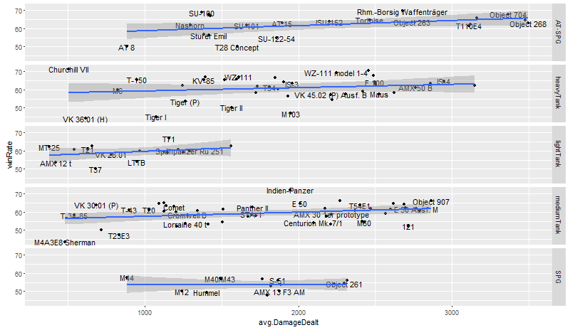

ShinyWot App
========================================================
author: Dmitri Peredera
date: feb 2016

Intro
========================================================

World of Tanks statistics helper [ShinyWot](https://muhomorik.shinyapps.io/ShinyWot/).

Shows some charts based on WG API.

- Battles fought histogam.
- WinRate histogam.
- dnorm for WinRate chart.
- Average damage dealt vs WinRatio by Vehicle type.
- Spotted tanks vs WinRatio by Vehicle type.

Or at least a small part.

Wargaming API
========================================================

[Wargaming.net Public API](https://eu.wargaming.net/developers/documentation/guide/getting-started/) is a set of API methods that provide access to Wargaming.net content, including in-game and game-related content, as well as player statistics.

- RESTfull requests
- json response back

For request the following parameters must be specified:

- Target uri, like: api.worldoftanks.eu/wot/encyclopedia/vehicles
- account_id for returning player stats.

There are also additional headers to use:

- fields, extra, tank_id can be used to customise the results.

Structure and workflow
========================================================

**Libraries:**

Source code: [GitHub](https://muhomorik.shinyapps.io/ShinyWot/)https://github.com/Muhomorik/ShinyWot

**Initialization:**

During the first start, the app will try to fetch the tank list from the API.
Tank names and tiers are rarely changed and therefore a local copy is saved and used
if possible.

The values are converted to data.frame and saved to *Vehicles* variable and
*TankopediaVehicles.csv* file.

Workflow
========================================================

- Create request uri and use *jsonlite* to get json and convert it to data.frame
(*VehicleStats*).
- Some values are calculated based on average values and the total battles fought.
- Data.tables are merged by *tank_id*. Tier, type and name are swon together with the stats.
- Extreme winRate values are deleted. Two (2) sd are used, keeping 95.449% of values.
The very low (0%) or high(100%) WinRate indicates the low battle count and disturbs the charts.
The *ideal* WinRate is 50% (by devs).
- Additional UI filers like *Tier* or *in garage*.
- Plot results and Shiny back to page.

Results
========================================================

The resulta are a few different charts, divided by the vehicle type and showing
the Win Ration against some parameters.
Unfortunately, the data is not that intresting and I am going to digg more variables.

Visit the demo:
[https://muhomorik.shinyapps.io/ShinyWot/](https://muhomorik.shinyapps.io/ShinyWot/)

