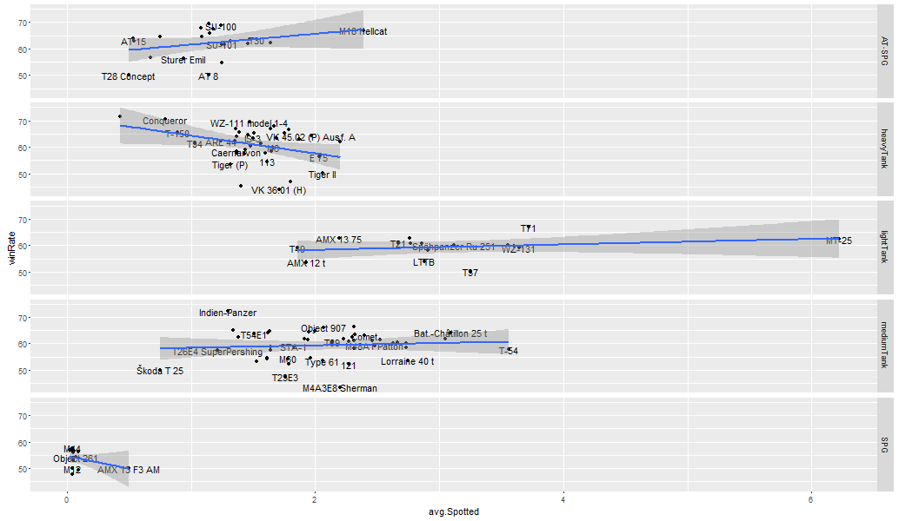
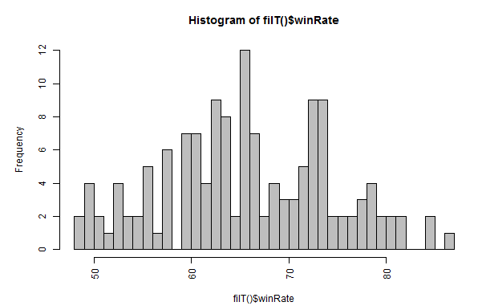
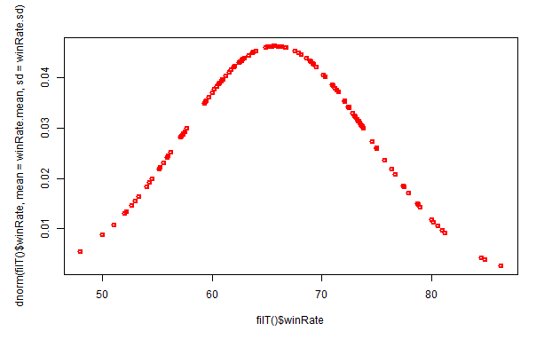

# ShinyWot

Course Project: Shiny Application and Reproducible Pitch

[ShinyApp (when running)](https://muhomorik.shinyapps.io/ShinyWot/) 
[RPubs presentation](http://rpubs.com/Muhomorik/ShinyWot)

# Abstract #

This is my "pet toy" project. Once upon a time I use to play MMORPG World of Tanks.

The good thind is thet [Wargaming ](https://eu.wargaming.net/developers/documentation/guide/getting-started/) provide an API (json).

So I decided to take a look and make a simple app to perform requests and plot response. The idea was to check how warious types of vehicles perform for the articular player.

I am not very happy with the current results and the signle player data is not enough. So I will keep digging after this course.

# Input #

Only "random" battles are taken.

Choose against some pre-defined players. I've included some:

- Na`Vi (e-sports chamions) players.
- Good SPG players to see different king of stats.
- Russian popular streamers (youtube.com)

Tier

- Most pupular tiers are 7-8 and 10.

In garage

- Take only owned vehicles.

# Results #

The result is some charts like [Spotting](http://wiki.wargaming.net/en/Battle_Mechanics#Spotting_Mechanics) vs Win Ratio

WinRatio histogram across tanks

And normalised (with dnorm) chart (normal distribution).
